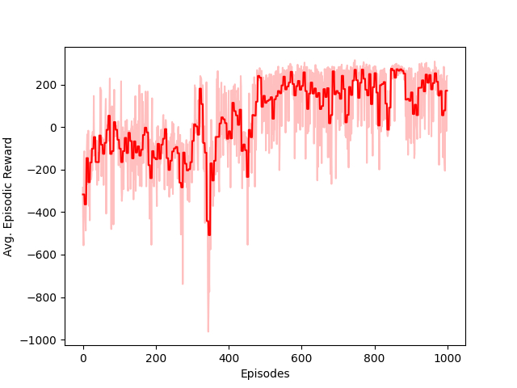

# DDPG Algorithm for Continuous Action RL
DDPG algorithm incorporates Actor-Critic Deep Learning Agent for solving continuous action reinforcement learning problems.

## Result
------------------------- OLD Implementation -> Vanilla DDPG ------------------------------
1. Algorithm was used to solve 'LunarLanderContinous-V2' openai-gym environment.
* Training Avg. Reward history over episodes,
<p ></p>


## Dependencies
Install dependencies using:
```bash
pip3 install -r requirements.txt 
```
## Challenge
* Achieve the goal position with minimum episode steps

## Contact
* email: navalekanishk@gmail.com